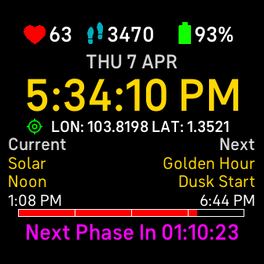

<div align="center">

  <h3 align="center">DayBreak</h3>

  <p align="center">
    Fitbit Clock Face for tracking imminent phase of day (e.g. Civil Twilight, Golden Hour, Astronomical Dusk etc.) by calculating sun position timings. GPS connection required. Compatible with Fitbit Sense and Fitbit Versa 3.
  </p>

  <p align="center">
  <a href="https://fitbit.com"></a>
  <a href="https://nodejs.org"></a>
  </p>

  <p align="center">
  <a href="https://github.com/elliotwutingfeng/DayBreak/stargazers"></a>
  <a href="LICENSE"></a>
  </p>

  

</div>

## Features

- [x] :heart: Heart Rate reading
- [x] :athletic_shoe: Daily Step counter
- [x] :battery: Battery Status
- [x] :watch: Date & Time
- [x] :globe_with_meridians: GPS connection status & GPS coordinates
- [x] :sunrise_over_mountains: Names and timings of Current and Next phases of day
- [x] :hourglass_flowing_sand: Progressbar and countdown timer to Next phase of day

## Getting Started

### Prerequisites

- Node.js 16 (currently not compatible with Node.js 17+)
- Fitbit OS Simulator (Windows/Mac only) or Fitbit Sense or Fitbit Versa 3

### Setup Instructions

`git clone` and `cd` into the project directory, then run the following

```bash
npx fitbit-build && npx fitbit
```

After logging in, you should be in the Fitbit CLI (i.e. `fitbit $`).

If you are using your Fitbit device, ensure that **Developer Bridge** is enabled and **Connected**. If you are using Fitbit OS Simulator, ensure that it is launched and **Connected**. In the Fitbit CLI, run

```bash
build-and-install
```

The Clock Face should now be running on your Fitbit device or Fitbit OS Simulator.

#### Tip

To exit Fitbit CLI, press `Ctrl-C` twice.

## Notes

- The sun position timings are calculated using [suncalc3](https://github.com/Hypnos3/suncalc3).
- The sun position timings are theoretically accurate to within a minute for locations between +/- 72° latitude, and within 10 minutes outside of those latitudes. The nearer you are to the equator, the more accurate the timings. However, due to variations in weather conditions, observed values may vary from calculations. More information is available [here](https://gml.noaa.gov/grad/solcalc/calcdetails.html).

## Acknowledgements

- https://dev.fitbit.com/blog/2018-08-23-cli-tools
- https://github.com/Hypnos3/suncalc3
- https://gml.noaa.gov/grad/solcalc/calcdetails.html
- http://suncalc.net
